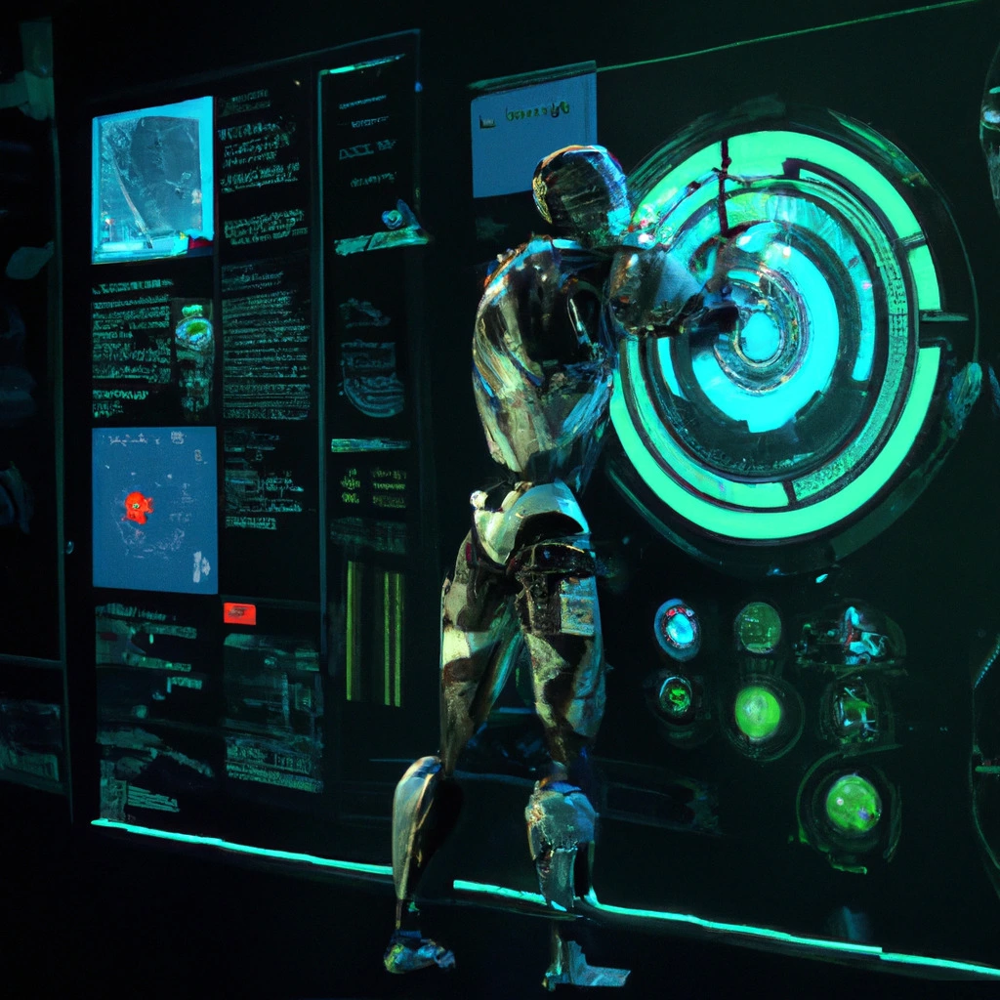

Artificial intelligence (AI) is becoming a more significant component of software development as technology progresses. Developers who adopt AI technology will have a significant competitive advantage in the years to come as it has the potential to revolutionize the way we design, build, and maintain software. This article will examine the potential applications of AI in software development for both developers and businesses.

### AI and Software Design

Software design is one of the most important aspects of software development, and AI has the potential to **revolutionize** the way we approach it. With the help of AI, developers can analyze large amounts of data and generate insights that can inform the design process. AI can also help identify patterns and trends that might not be immediately apparent to human developers.

One of the most exciting areas of AI in software design is generative design. This technology uses algorithms to create multiple design options based on specific parameters. AI can analyze user behavior and usage patterns to predict future needs and tailor software design and functionality accordingly. This process can save developers a significant **amount of time** and result in more creative and innovative designs.

Also regarding code optimizations, AI algorithms can optimize code performance by analyzing and improving algorithms and data structures, making software design more efficient and effective.

### AI and Software Development

AI has the potential to completely change how we approach software design, which is one of the most crucial aspects of software development. Developers can use AI to analyze vast amounts of data and produce insights that can guide the design process.

The first thing I can think of is Github Copilot here. I had the chance to play with it a little and test it's capabilities. 

Copilot can suggest **code fragments** and even entire functions based on the **context** of the code you're working on thanks to its ability to analyze enormous amounts of code. As a result, I can work more effectively and **productively** while concentrating on more imaginative projects.

 Because of its integration with GitHub, this tool is even more readily available to developers all over the world and is poised to revolutionize the way we approach software development. While it is still in it's infacy I saw the best fir for it when writing new features. With existing features or a more complex bussiness requirements it still has to struggle a bit.

This is just the begining. GitHub is expanding its **AI-powered code generation tool**, GitHub Copilot, with new features aimed at streamlining the development process called [GitHub Copilot X](https://github.blog/2023-03-22-github-copilot-x-the-ai-powered-developer-experience/). Highlights of GitHub Copilot X include:
 *  Copilot Chat is a new **chat interface** that integrates with Microsoft's Visual Studio Code and provides in-depth code analysis, bug fixes, and unit tests.
 *  Copilot for **Pull Requests** automatically fills out tags based on changed code and offers suggested descriptions. 
*   Copilot for Docs provides AI-generated responses to questions about documentation, with initial coverage of React, Azure Docs, and MDN. A [waitlist](https://githubnext.com/projects/copilot-for-docs). is available for this capability.
 *  Copilot for the **CLI** allows for composing commands and loops with ease. 
  
  These updates promise to **enhance the development experience** for developers worldwide and I cannot wait to see how it would evolve our developemnt capabilities.

### The Future of Automation

AI will become more vital to the software development process as it develops. We can anticipate even more automation in the future as AI takes on more challenging tasks, **freeing up developers to work on more imaginative projects**. This will result in more innovative and user-friendly software, as well as an increase in productivity.

It's crucial to remember that automation does not mean that human involvement in software development is no longer necessary. In actuality, a symbiotic relationship between humans and AI in software development is most likely. Although AI can increase productivity and efficiency for developers, it is human ingenuity and creativity that truly makes software great.

### Competitive Advantage

Businesses that embrace AI in software development will have a significant **competitive edge** in the years to come. By using AI to automate tasks and improve accuracy, developers can create software that is faster, more reliable, and more user-friendly than their competitors. This can result in **increased revenue**, **customer satisfaction**, and **market share**. Those who will use AI will always be a step ahead of those who do not. As evidenced by the rapid advancement of smartphones, those who embrace new technology can reap significant benefits in terms of capabilities and efficiency. Think of the Iphone release back in 2007. That's how I feel using AI now for development and design.

However, it's important to approach AI in software development with caution. While AI can be incredibly useful, it's not a panacea. It's important to **balance automation with human involvement** and creativity to create software that truly meets the needs of users.

### Conclusion

I feel that everyday I find out new stuff and new tips and tricks on how to use AI as a developer to be more efficient and capable. It's like we are developing a symbiotic relationship with AI.

Software development is already significantly impacted by AI, and this impact will continue to grow in the years to come. Developers can increase productivity, produce more inventive software, and gain a competitive advantage in the market by embracing this technology. To balance automation with human involvement and creativity, it's crucial to approach AI in software development with caution. AI has the potential to **completely reshape software** development and enable us to produce applications that are truly user-centric.

